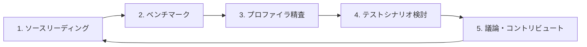

# Biryani Wiki スキル

## ゴール

**ruby/ruby の Ractor にコントリビュートする** — パフォーマンスに関する issue 報告または改善 PR。

biryani（Ractor ベースの HTTP/2 サーバー）を通じて、HTTP の豊富なベンチマークツールで Ractor をストレステストする。

## サイクル

各セッションは以下のサイクルのどこかから始まり、知識ベースを前進させる：



**ステップ 2・3 に入るときは `/biryani-benchmark` を呼び出すこと。**

セッション終わりに必ず：
- 発見・仮説・疑問を wiki に記録する
- 次のサイクルのステップを1つ提案する
- コントリビュート候補があれば `wiki/contributions/` に追記する

wiki の保守（lychee・index.md/source-reading-guide.md 更新・整合性確認）が必要なときは `/wiki-review` を呼び出すこと。

## プロジェクトのコンテキスト

| 要素 | 詳細 |
|------|------|
| プロジェクトルート | `/path/to/thekuwayama/biryani-benchmarks` |
| Lima VM | ベンチマーク・perf は Lima VM 上の Linux で動作。コマンドは `limactl shell --workdir /biryani-benchmarks lima bash -c 'eval "$(rbenv init -)" && <コマンド>'` |
| ruby/ruby ソース | `raw/ruby-src/`（v4.0.2 サブモジュール）— `ractor.c`, `ractor_sync.c`, `thread_pthread.c` など |
| biryani ソース | `raw/biryani/`（v0.0.12 サブモジュール）— アーキテクチャ調査時に読む |
| Wiki | `wiki/` — Claude が書き、ユーザーが読む |

最新の知見（スループット・CPU/wall time 内訳・コントリビュート候補）は [wiki/status.md](../../wiki/status.md) を参照。

## 操作

### 1. ソースリーディング

ruby/ruby の Ractor 関連ソースを調査するとき：

- 対象ファイル（ruby/ruby）: `raw/ruby-src/ractor.c`, `raw/ruby-src/ractor_sync.c`, `raw/ruby-src/thread_pthread.c`, `raw/ruby-src/vm_core.h`
- 対象ファイル（biryani）: `raw/biryani/lib/` 以下 — Ractor アーキテクチャや I/O パターンを調査するとき
- 推奨読書順・関数・行番号は [wiki/source-reading-guide.md](../../wiki/source-reading-guide.md) を参照
- 調査結果を `wiki/internals/<トピック>.md` に記録する
- 新しい internals ページを作成したら `wiki/source-reading-guide.md` のテーブルに該当関数・行番号を追記し、wiki 列に逆リンクを張る
- 発見がベンチマーク結果と結びつくなら `[[findings/...]]` とクロスリファレンスを張る
- 「なぜそう実装されているか」を問い、仮説を `wiki/questions/` に追記する

### 4. テストシナリオ検討

新しいシナリオを設計するとき：

- **何を測りたいか**を明確にする（Ractor 生成コスト / GC 圧力 / I/O 待機 / 同期オーバーヘッド）
- `load/` にスクリプトを追加して実装する
- 結果を既存の findings と比較する
- ruby/ruby のどのコードパスが変化するかをソースで確認する

**有用なシナリオの軸**:
- POST ボディサイズを変化させる（GC 圧力の定量化）
- `-c` / `-m` / `-t` のスイープ（最適点の探索）
- 接続を保持 vs 都度切断（Ractor ライフサイクルのコスト）

### 5. 議論・コントリビュート

コントリビュート候補を `wiki/contributions/<名前>.md` に記録する：

```markdown
---
date: YYYY-MM-DD
type: issue | pr
status: 候補 | 調査中 | 提出済み | クローズ
---

# タイトル

## 問題・提案

## 根拠（ベンチマーク・プロファイラ結果へのリンク）

## 関連する ruby/ruby のコード

## 次のステップ
```

コントリビュートの判断基準：
- データで裏付けられているか（ベンチマーク数値 + プロファイラ結果）
- ruby/ruby のどのコードが関係するか特定できているか
- 再現可能なシナリオがあるか

**絶対に守ること — LLM wiki ループの責任範囲**: このスキルは `wiki/contributions/` への記録までを担う。issue・PR の実際の提出は**絶対に行わない**。提出は wiki を読んだ人間が、調査内容を自分で理解した上で責任を持って行うべきである。LLM が生成した調査結果をそのまま提出することは、PR に対する本人の理解と責任が担保されないため避ける。
