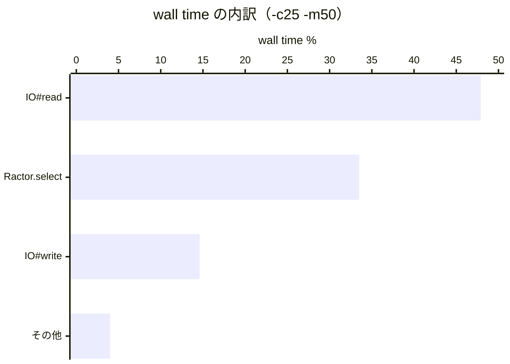

# rperf（wall モード）vs perf（CPU モード）— プロファイラ比較と新発見

## プロファイラの動作結果

| プロファイラ | 結果 | 備考 |
|-------------|------|------|
| perf + FlameGraph | ✅ 動作 | sudo 必要、C フレームレベル、unknown 24% |
| rperf wall モード | ✅ 動作 | sudo 不要、Ruby メソッドレベル、GVL/GC ラベル付き |

Raw sources: `raw/rperf_c25_m50_wall.json.gz`、`raw/flamegraph_c25_m50.svg`

## rperf wall モード結果（-c25 -m50）

### Flat（関数単体の wall time）

| 関数 | wall time | 割合 |
|------|-----------|------|
| `IO#read` | 28,914ms | **47.9%** |
| `Ractor.select` | 20,233ms | **33.5%** |
| `IO#write` | 8,813ms | **14.6%** |
| `Kernel#system` | 1,366ms | 2.3%（h2load プロセス） |
| `Ractor::Port#receive` | 324ms | 0.5% |
| `HTTP::Response.default` | 130ms | 0.2% |
| `Ractor::Port#send` | 41ms | 0.1% |
| `Ractor.new` | 16ms | **0.0%** |

### Cumulative（コールスタック累積）

| 関数 | wall time | 割合 |
|------|-----------|------|
| `Kernel#loop` | 58,374ms | 96.8% |
| `Biryani::Server#run` | 29,428ms | 48.8% |
| `Biryani::Connection#serve` | 29,353ms | 48.7% |
| `Biryani::Connection#select_loop` | 29,342ms | 48.6% |
| `Biryani::Connection#recv_loop` | 29,192ms | 48.4% |
| `Biryani::Frame.read` | 28,934ms | 48.0% |
| `IO#read` | 28,914ms | 47.9% |
| `Ractor.select` | 20,233ms | 33.5% |
| `Biryani::Connection#handle_response` | 8,679ms | 14.4% |
| `Biryani::Connection.send_headers` | 7,212ms | 12.0% |
| `Biryani::Stream#initialize` | 525ms | 0.9% |
| `Biryani::Connection#recv_dispatch` | 401ms | 0.7% |

## 最大の発見：biryani は I/O バウンドだった

### perf CPU プロファイルが見せていたもの

perf は CPU サンプルを取るため、CPU を使っている処理が誇張される：
- `thread_create_core` / `native_thread_create`: ~5% → **「Ractor 生成がボトルネック」に見えた**
- `do_futex` / `futex_wake`: ~11% → **「Ractor 同期が重い」に見えた**

### rperf wall プロファイルが見せたもの

wall time（実経過時間）で測ると：
- `IO#read`: **47.9%** → サーバーの半分の時間はソケット読み込み待ち
- `Ractor.select`: **33.5%** → イベントループが次のフレーム or ストリーム応答を待つ
- `IO#write`: **14.6%** → レスポンスのソケット書き込み
- `Ractor.new`: **0.0%** → Ractor 生成は wall time ではほぼゼロ

**perf で「重い」と見えた Ractor 生成は、CPU 時間の問題であって wall time の問題ではなかった。**

### 解釈

biryani のボトルネックは **I/O 待機**であり、Ractor の生成・同期のオーバーヘッドではない。`Ractor.select` の 33.5% は recv_loop と stream Ractor 双方からのメッセージを待つ構造的な待機時間。

## perf と rperf の相補性

| 問い | perf が答える | rperf が答える |
|------|--------------|---------------|
| どの OS スレッドが CPU を使うか | ◎ | △ |
| GC がどこで発生するか | △（フレーム名で類推） | ◎（ラベルで明示） |
| どの Ruby メソッドが遅いか | ✗（unknown が多い） | ◎ |
| Ractor 生成コスト | ○（CPU 時間として） | ◎（wall time として） |
| I/O 待機の把握 | ✗（CPU サンプルのみ） | ◎ |

## 次に調べると良いこと

1. `IO#read` の 47.9% を削減できるか — ノンブロッキング I/O の採用可否
2. `Ractor.select` の 33.5% の内訳 — recv_loop と stream 応答の比率

## 関連ページ

- [[findings/flamegraph-baseline-cpu-profile]]
- [[findings/flamegraph-c25-m50-vs-baseline]]
- [[internals/biryani-ractor-architecture]]
- [[internals/ractor-port-implementation]]
