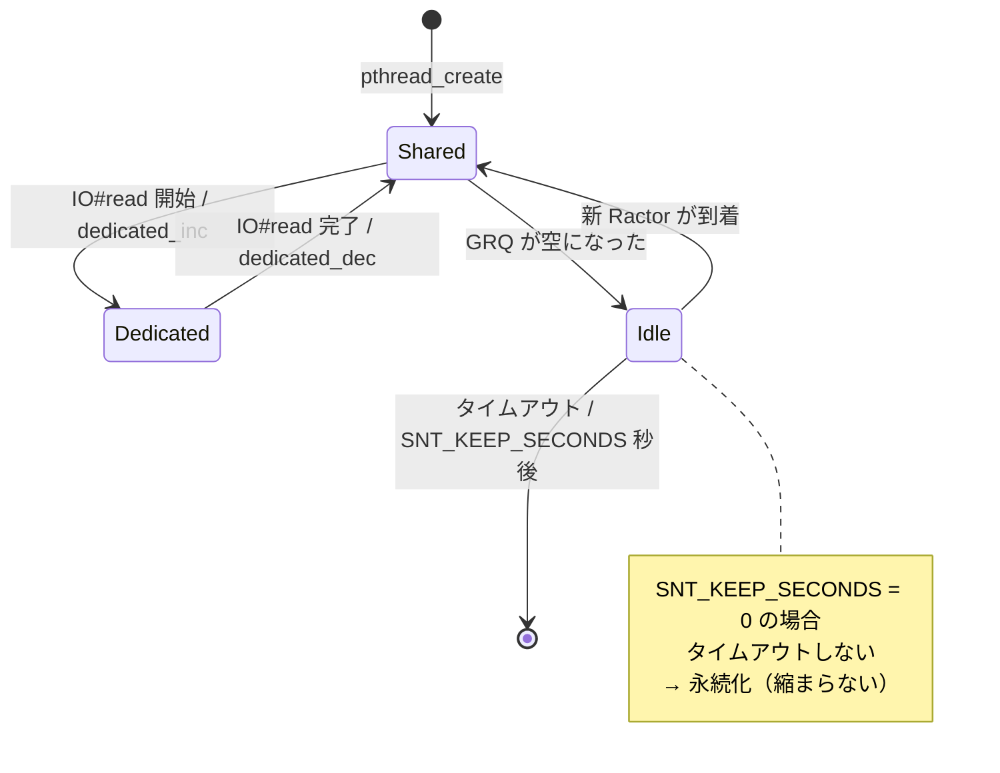
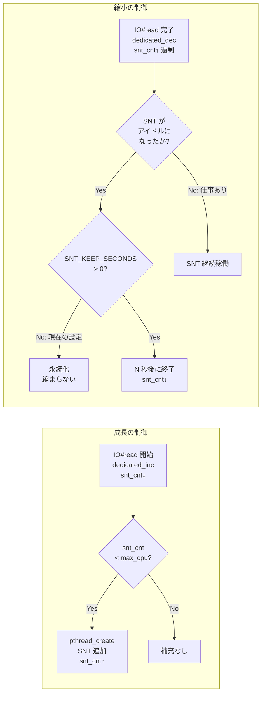
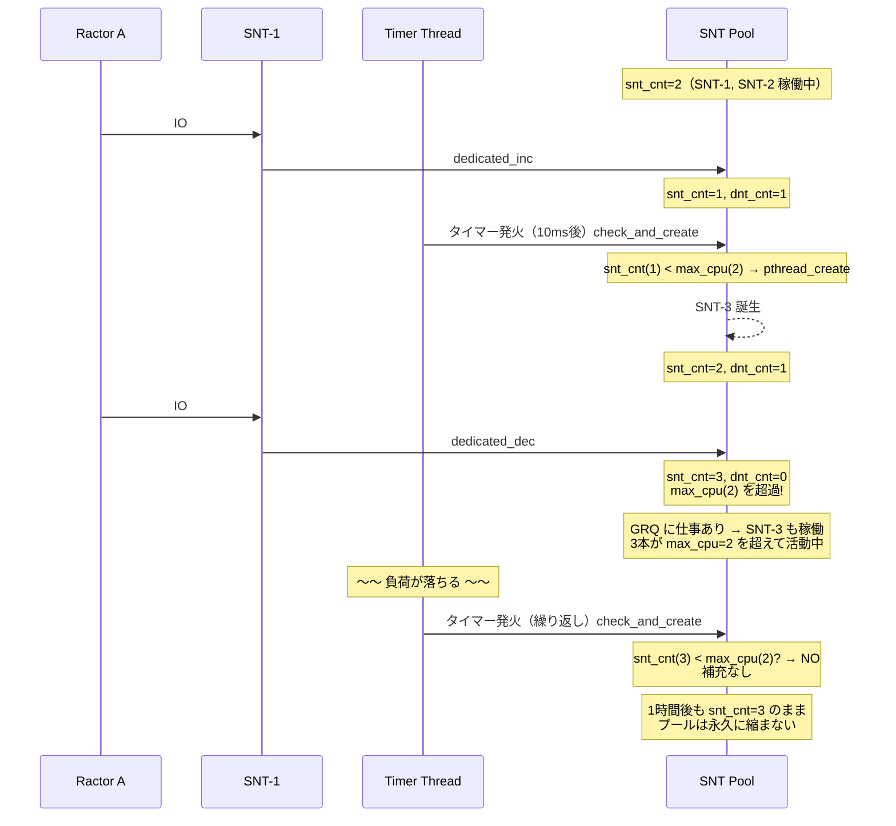
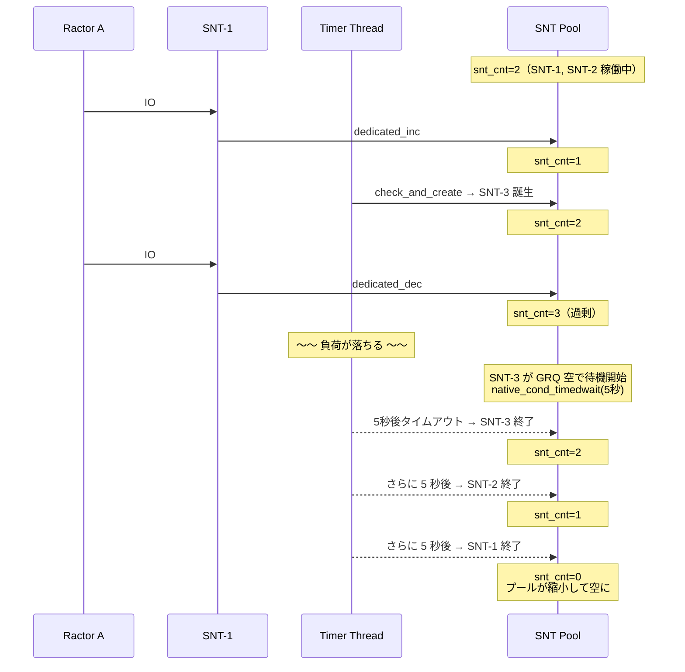
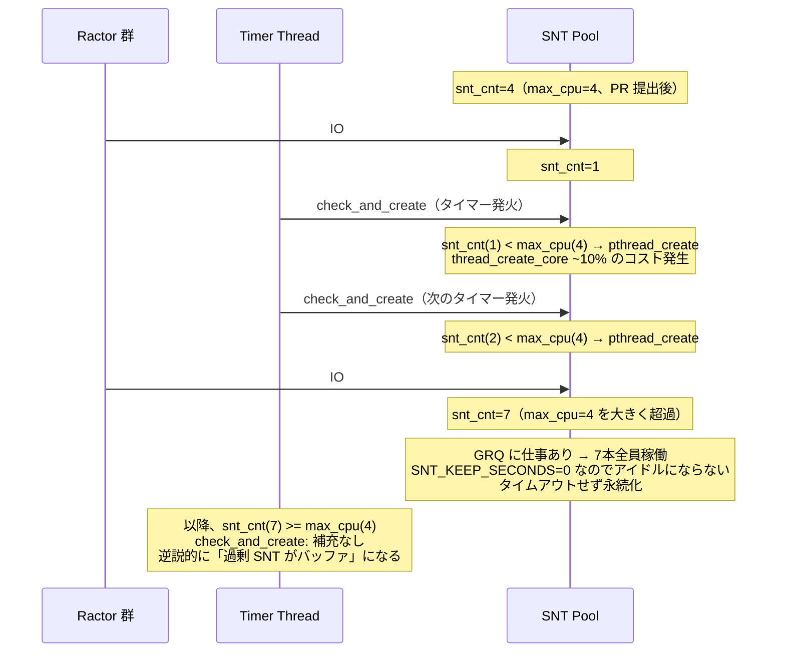
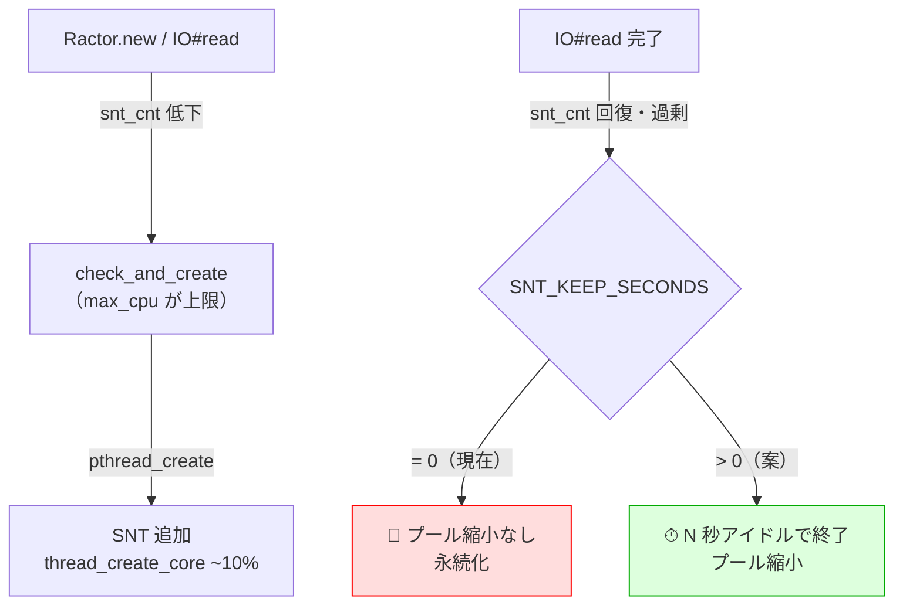

# M:N スケジューラ：SNT プールの成長と縮小

`max_cpu` と `SNT_KEEP_SECONDS` の 2 パラメータがそれぞれ SNT プールの
「成長の上限」と「縮小の速度」を担い、セットで機能する設計になっている。
現在は `max_cpu` のみが設定されており（マージ済み（e98f95b4fd）で物理コア数に変更）、
縮小側の `SNT_KEEP_SECONDS = 0` が無効のまま。

## SNT の状態遷移

SNT は「共有（Shared）」「専有（Dedicated）」「アイドル（Idle）」の 3 状態を遷移する。

Dedicated 状態は一時的（IO の完了まで）で、完了後は必ず Shared に戻る。
Idle → 終了 のパスが `SNT_KEEP_SECONDS` で制御される唯一の縮小経路。

## 2 パラメータの役割

| パラメータ | 制御対象 | 現在の値 |
|-----------|---------|--------|
| `max_cpu` | SNT の増える上限 | ~~8~~ → マージ済み（e98f95b4fd）で物理コア数に変更 |
| `SNT_KEEP_SECONDS` | アイドル SNT の生存時間 | **0 = 永久に消えない** |

## 時系列シナリオ：max_cpu = 2 の場合

### 共通の前提

- `max_cpu = 2`、`MINIMUM_SNT = 0`
- Ractor が 10 個、全員が定期的に `IO#read` を呼ぶ
- タイマー間隔 ≈ 10 ms

### ケース A：SNT_KEEP_SECONDS = 0（現在のデフォルト）

### ケース B：SNT_KEEP_SECONDS = 5

## biryani（常時高負荷 IO）での振る舞い

biryani では `IO#read` が wall time の 47.9% を占め、常時 dedicated_inc/dec が発生する。

**逆説的な効果**: 常時高負荷では、蓄積した extra SNT が次の IO drop のバッファになり、
`pthread_create` の頻度を下げる。しかし負荷が落ちたとき（夜間・連休後）に
余剰 SNT が大量に残存してメモリとスケジューラのオーバーヘッドを占有し続ける。

## 非対称構造のまとめ

`max_cpu`（上限）はマージ済み（e98f95b4fd）。`SNT_KEEP_SECONDS`（縮小）が次の候補。

## 関連ページ

- [source-reading-guide](../source-reading-guide.md) — ソースコード読み方ガイド
- [findings/snt-keep-seconds-disabled](../findings/snt-keep-seconds-disabled.md)
- [internals/ractor-overview](ractor-overview.md) — GRQ の定義・SNT の概要
- [internals/ractor-mn-snt-lifecycle](ractor-mn-snt-lifecycle.md)
- [contributions/snt-replenishment-overhead](../contributions/snt-replenishment-overhead.md)
- [contributions/default-max-cpu-cpu-count](../contributions/default-max-cpu-cpu-count.md)
