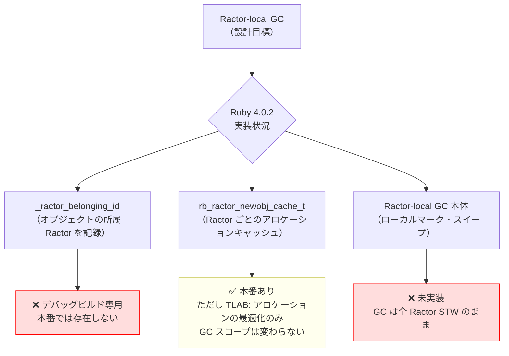

# Ractor-local GC の現状（Ruby 4.0.2）

RubyKaigi 2025 で ko1 が発表した "Toward Ractor Local GC" をベースに、
Ruby 4.0.2 ソースコードで実際の実装状況を確認した記録。

参照:
- 発表ページ: https://rubykaigi.org/2025/presentations/ko1.html
- スライド PDF: https://atdot.net/~ko1/activities/2025_rubykaigi2025.pdf

## ko1 の発表（RubyKaigi 2025）の要旨

**現状の課題**:
- 全 Ractor がグローバルな Object Space を共有している
- GC 実行時に全 Ractor を停止する必要がある → 並列性の恩恵が損なわれる

**提案**:
- Ractor ごとに独立した Object Space を持つ（Ractor-local GC）
- non-shareable オブジェクト（copy されたもの）は所有 Ractor のローカル GC で回収
- shareable オブジェクト（Class、frozen オブジェクト等）は "常に生きている" として扱い、グローバル GC に任せる

**ベンチマーク結果**（発表内）:
- 短命オブジェクト生成の多い Ractor ワークロードで **約 5 倍のスループット改善**
- Ractor 数が増えてもパフォーマンスが安定する

**実装ターゲット**: Ruby 3.5（2025 年 12 月）

## Ruby 4.0.2 ソースコードでの実装状況

### GC は依然としてグローバル STW

```c
// gc/default/default.c:6686-6692
switch (event) {
  case gc_enter_event_start:
  case gc_enter_event_continue:
    rb_gc_vm_barrier(); // stop other ractors  ← 全 Ractor を止める
    break;
}
```

`gc_start`（GC のエントリポイント）で `rb_gc_vm_barrier()` が呼ばれており、
**Ruby 4.0.2 時点では全 Ractor を停止するグローバル GC のまま**。
Ractor-local GC の分岐は存在しない。

### インフラは部分的に存在する（デバッグ専用）

#### `_ractor_belonging_id`（デバッグビルド専用）

```c
// gc/default/default.c:651-660
#if RACTOR_CHECK_MODE || GC_DEBUG
struct rvalue_overhead {
# if RACTOR_CHECK_MODE
    uint32_t _ractor_belonging_id;  // ← Ractor ID を記録するフィールド
# endif
};
```

`RACTOR_CHECK_MODE` は `VM_CHECK_MODE || RUBY_DEBUG` のときのみ有効。
**本番ビルドには含まれない**。将来の Ractor-local GC のための「布石」として存在している。

セット・参照も debug 専用:

```c
// ractor_core.h:273
#if RACTOR_CHECK_MODE > 0
# define RACTOR_BELONGING_ID(obj) ...
  static inline void rb_ractor_setup_belonging_to(VALUE obj, uint32_t rid) { ... }
#endif
```

#### `rb_ractor_newobj_cache_t`（本番あり — ただし TLAB）

```c
// gc/default/default.c:199-202
typedef struct ractor_newobj_cache {
    rb_ractor_newobj_heap_cache_t heap_caches[HEAP_COUNT];
} rb_ractor_newobj_cache_t;
```

各 Ractor がオブジェクト確保用のキャッシュを持つ（TLAB: Thread-Local Allocation Buffer 相当）。
これはアロケーション時のロック競合を減らすための最適化であり、
**GC の回収スコープ（Object Space）を分けるものではない**。

NEWS.md（Ruby 4.0.2）での言及:
> "CPU cache contention is avoided in object allocation by using a per-ractor counter"

### 実装状況の整理



## `Ractor.new(ob)` のオブジェクト渡しとGCの関係（議論の整理）

### ユーザーの考察（正しい部分）

```ruby
Ractor.new(ob) { |o| ... }
# ≈ r1 = Ractor.new { |o| ... }; r1.send(ob, move: false)
```

- non-shareable `ob` は Marshal deep copy される → **コスト発生**（正しい）
- copy されたオブジェクトは r1 だけが参照を持つ → **正確性の保証**（正しい）
- shareable（Integer, frozen 等）はコピーされず参照渡し → **正しい**

### 補正が必要な部分

| 考察 | Ruby 4.0.2 での実際 |
|------|------------------|
| 「r1 の Object Space にコピーを作成する」 | **設計意図は正しい**。ただし現実装では全オブジェクトが共有グローバルヒープ上に存在する |
| 「グローバル GC を待たずに回収できる」 | **Ruby 4.0.2 では成立しない**。GC は依然として全 Ractor を止める STW |
| 「Ractor-local GC で回収できて有利」 | **将来の方向性として正しい**。ko1 が目指している姿。現時点での有利点は「r1 しか参照しない」という局所性のみ |

### 現在の「copy の有利な点」

Ractor-local GC なしでも copy が持つ意味：

1. **参照局所性**: r1 だけが参照を持つため、GC のマークフェーズで他 Ractor からたどられない（マークコストが低い）
2. **正確性保証**: 送信後に元 Ractor がオブジェクトを変更しても r1 に影響しない
3. **将来への投資**: `_ractor_belonging_id` の布石が存在する。Ractor-local GC 実装後は真に有利になる

## 関連ページ

- [internals/ractor-overview](ractor-overview.md)
- [findings/rperf-wall-vs-perf-cpu](../findings/rperf-wall-vs-perf-cpu.md)
