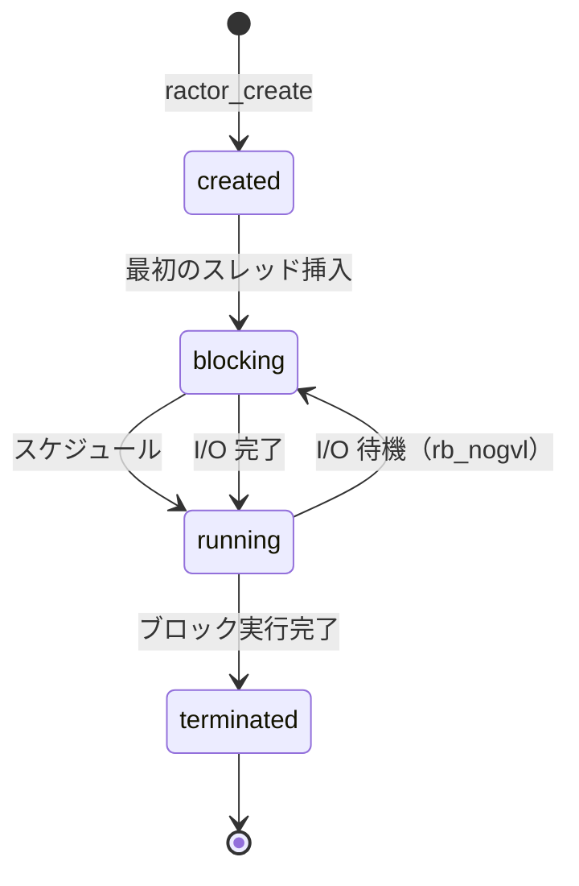

# Ractor 全体像（ruby/ruby v4.0.2）

ruby/ruby の Ractor が何者で、どう動くかを一枚に整理する。
biryani の実装を読む前提知識として、また発見を ruby/ruby の文脈に位置づけるための参照ページ。

## Ractor とは

Ractor（Ruby Actor）は Ruby 3.0 で導入された並行処理プリミティブ。
「オブジェクトの所有権分離」によってデータ競合を原則防ぎながら、OS スレッドの真の並列実行を可能にする。

Thread との最大の違い:
- **Thread**: 全スレッドが1つの GVL（Global VM Lock）を共有 → Ruby コードは同時実行できない
- **Ractor**: 各 Ractor が独自の GVL を持つ → 複数 Ractor が真に並列実行できる

## OS スレッドとのマッピング

**1 Ractor = 1 OS スレッド（pthread）**。

ユーザーレベルのグリーンスレッドではなく OS に直接マッピングされる。このため:
- 生成コストはシステムコールレベル（`pthread_create`、スタック確保）
- Ractor 数がコア数を大きく超えると OS スケジューラの競合でスループットが低下
- biryani の最適点 `-c25 -m50`（1,300 Ractors）でも 4コア環境でオーバーサブスクリプションが起きる

## ライフサイクル



ソース: `ractor_status_set`（`ractor.c:164`）、状態名は `ractor_status_str`（`ractor.c:152`）

- **created**: メモリ確保済み、まだ実行開始前
- **running**: Ruby コードを実行中
- **blocking**: ブロッキング I/O 等で待機中（`rb_nogvl` の外側）
- **terminated**: ブロック実行完了

## 内部構造体

### `rb_ractor_t`（`ractor_core.h:68`）

Ractor の本体。`rb_ractor_struct` の typedef。

```c
struct rb_ractor_struct {
    struct rb_ractor_pub  pub;      // Ruby オブジェクト表現・ID・フック
    struct rb_ractor_sync sync;     // ロック・キュー・Port（スレッド間共有部）

    struct {
        struct ccan_list_head set;  // このRactor内のスレッドリスト
        unsigned int cnt;
        unsigned int blocking_cnt;
        unsigned int sleeper;
        struct rb_thread_sched sched;
        rb_execution_context_t *running_ec;
        rb_thread_t *main;
    } threads;

    VALUE name;
    VALUE loc;
    enum ractor_status status_;     // created/running/blocking/terminated

    struct ccan_list_node vmlr_node; // vm->ractor.set へのリンク

    st_table    *local_storage;     // Ractor ローカル変数
    VALUE        r_stdin;           // Ractor 固有の $stdin/$stdout/$stderr
    VALUE        r_stdout;
    VALUE        r_stderr;
    // ...
};
```

### `rb_ractor_pub`（`vm_core.h:2328`）

Ruby レベルから見える公開フィールド。

```c
struct rb_ractor_pub {
    VALUE        self;              // Ruby オブジェクトとしての自身
    uint32_t     id;                // Ractor#id の値
    rb_hook_list_t hooks;           // TracePoint フック
    st_table    *targeted_hooks;
    unsigned int targeted_hooks_cnt;
};
```

### `rb_ractor_sync`（`ractor_core.h:15`）

スレッド間で共有されるすべての状態。ractor lock（`sync.lock`）で保護される。

```c
struct rb_ractor_sync {
    rb_nativethread_lock_t  lock;           // pthread_mutex：Ractor 操作全般を保護

#ifndef RUBY_THREAD_PTHREAD_H
    rb_nativethread_cond_t  wakeup_cond;    // Win32 のみ。pthread 実装は rb_nogvl を使う
#endif

    struct ractor_queue    *recv_queue;     // 全Portへの着信を受け取る共通キュー
    struct ccan_list_head   waiters;        // recv 待機中のスレッド（ractor_waiter のリスト）

    VALUE                   default_port_value;
    struct st_table        *ports;          // port_id → ractor_queue のハッシュ
    size_t                  next_port_id;

    struct ccan_list_head   monitors;       // join 待ちの監視 Ractor
    rb_ractor_t            *successor;      // 終了時に値を渡す先
};
```

### `ractor_basket`（`ractor_sync.c:198`）

キューを流れるメッセージ1件。

```c
struct ractor_basket {
    enum ractor_basket_type type;   // none / ref / copy / move
    VALUE     sender;               // 送信元
    st_data_t port_id;              // 宛先ポートID

    struct {
        VALUE v;
        bool  exception;
    } p;                            // ペイロード

    struct ccan_list_node node;     // キューへの侵入リストノード
};
```

### `ractor_queue`（`ractor_sync.c:246`）

メッセージの連結リストキュー。`recv_queue`（共通着信）と per-port キューの両方に使われる。

```c
struct ractor_queue {
    struct ccan_list_head set;      // ractor_basket の侵入リスト
    bool closed;
};
```

### `ractor_waiter`（`ractor_sync.c:860`）

`ractor_wait` 中のスレッドを表す。`sync.waiters` リストに積まれる。

```c
struct ractor_waiter {
    enum ractor_wakeup_status wakeup_status;  // wakeup_none / wakeup_by_send / wakeup_by_interrupt
    rb_thread_t            *th;
    struct ccan_list_node   node;
};
```

### 構造体の関係図

```
rb_ractor_t
├── pub (rb_ractor_pub)
│   ├── self (VALUE)       ← Ruby オブジェクト
│   └── id (uint32_t)      ← Ractor#id
├── sync (rb_ractor_sync)
│   ├── lock               ← pthread_mutex
│   ├── recv_queue ────────→ ractor_queue
│   │                           └── [basket] → [basket] → ...
│   ├── waiters ───────────→ [ractor_waiter] → [ractor_waiter] → ...
│   └── ports (st_table)
│       └── port_id → ractor_queue
│                         └── [basket] → ...
├── threads
│   ├── set ───────────────→ [rb_thread_t] → ...
│   └── running_ec         ← 現在実行中の EC
└── status_                ← created/running/blocking/terminated
```

## オブジェクトの扱い — 共有モデル

Ractor 間で渡せるオブジェクトは3種類に分類される:

| 方法 | 動作 | 用途 |
|------|------|------|
| **copy**（デフォルト） | Marshal で深コピー | 通常のオブジェクト |
| **move**（`move: true`） | 所有権を移す。元 Ractor はアクセス不可 | 大きなオブジェクトのゼロコピー転送 |
| **shareable** | 参照をそのまま渡す | 読み取り専用データ |

Ractor-shareable なオブジェクト（参照共有可能）:
- Integer, Symbol, true/false/nil（即値）
- frozen なオブジェクト（ただし frozen な内部オブジェクトも全て shareable であること）
- `Ractor.make_shareable(obj)` で明示的に shareable 化
- `Ractor.shareable_proc { ... }` でブロックを shareable 化（biryani がハンドラ定義に使用）

## エラー体系

| 例外 | 発生条件 |
|------|---------|
| `Ractor::ClosedError` | 閉じたポートへの送受信 |
| `Ractor::RemoteError` | Ractor 内の未捕捉例外（`join`/`value` で再送出） |
| `Ractor::MovedError` | move 済みオブジェクトへのアクセス |
| `Ractor::IsolationError` | 非 shareable オブジェクトの共有試み |
| `Ractor::UnsafeError` | Ractor 安全でない操作 |

`ClosedError` は `StopIteration` を継承しているため、ループ内で `break` として扱われる。

## パフォーマンス上の特性

| 特性 | 内容 |
|------|------|
| 生成コスト | `pthread_create` + スタック確保 ≒ OS スレッドの生成コスト |
| wall time | biryani 実測で `Ractor.new` 0.0%（I/O 待機に比べて無視できる） |
| CPU 時間 | perf 実測で ~5-10%（`thread_create_core` + `nt_alloc_stack`） |
| 同期 | 1 send = 1 `pthread_cond_broadcast` = 1 futex syscall |
| 最適 Ractor 数 | 4コア環境で ~1,000〜1,500（biryani `-c25 -m50` = 1,300 Ractors） |

## 関連ページ

- [[internals/biryani-ractor-architecture]] — biryani がこれをどう使うか
- [[internals/ractor-port-implementation]] — Port と recv_queue の C 実装詳細
- [[internals/ractor-sync-wakeup]] — wakeup メカニズム（broadcast/signal 問題）
- [[findings/rperf-wall-vs-perf-cpu]] — 実測データ（wall time vs CPU time）
- [[contributions/cond-signal-vs-broadcast]] — PR 候補
