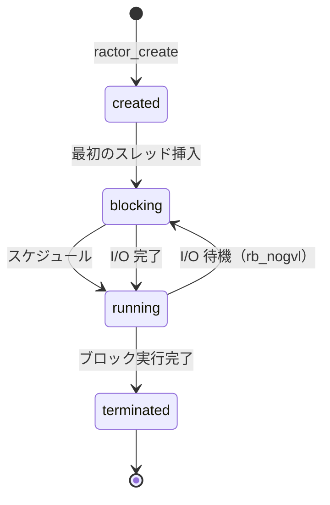

# Ractor 全体像（ruby/ruby v4.0.2）

ruby/ruby の Ractor が何者で、どう動くかを一枚に整理する。
biryani の実装を読む前提知識として、また発見を ruby/ruby の文脈に位置づけるための参照ページ。

## Ractor とは

Ractor（Ruby Actor）は Ruby 3.0 で導入された並行処理プリミティブ。
「オブジェクトの所有権分離」によってデータ競合を原則防ぎながら、OS スレッドの真の並列実行を可能にする。

Thread との最大の違い:
- **Thread**: 全スレッドが1つの GVL（Global VM Lock）を共有 → Ruby コードは同時実行できない
- **Ractor**: 各 Ractor が独自の GVL を持つ → 複数 Ractor が真に並列実行できる

## OS スレッドとのマッピング

**1 Ractor = 1 OS スレッド（pthread）**。

ユーザーレベルのグリーンスレッドではなく OS に直接マッピングされる。このため:
- 生成コストはシステムコールレベル（`pthread_create`、スタック確保）
- Ractor 数がコア数を大きく超えると OS スケジューラの競合でスループットが低下
- biryani の最適点 `-c25 -m50`（1,300 Ractors）でも 4コア環境でオーバーサブスクリプションが起きる

## ライフサイクル



ソース: `ractor_status_set`（`ractor.c:164`）、状態名は `ractor_status_str`（`ractor.c:152`）

- **created**: メモリ確保済み、まだ実行開始前
- **running**: Ruby コードを実行中
- **blocking**: ブロッキング I/O 等で待機中（`rb_nogvl` の外側）
- **terminated**: ブロック実行完了

## オブジェクトの扱い — 共有モデル

Ractor 間で渡せるオブジェクトは3種類に分類される:

| 方法 | 動作 | 用途 |
|------|------|------|
| **copy**（デフォルト） | Marshal で深コピー | 通常のオブジェクト |
| **move**（`move: true`） | 所有権を移す。元 Ractor はアクセス不可 | 大きなオブジェクトのゼロコピー転送 |
| **shareable** | 参照をそのまま渡す | 読み取り専用データ |

Ractor-shareable なオブジェクト（参照共有可能）:
- Integer, Symbol, true/false/nil（即値）
- frozen なオブジェクト（ただし frozen な内部オブジェクトも全て shareable であること）
- `Ractor.make_shareable(obj)` で明示的に shareable 化
- `Ractor.shareable_proc { ... }` でブロックを shareable 化（biryani がハンドラ定義に使用）

## 通信 API（Ruby 4.0）

Ruby 4.0 で `Ractor::Port` が正式 API になった。

```ruby
# Port の生成と送受信
port = Ractor::Port.new      # 受信用ポート
port << obj                  # 送信（Port#send のエイリアス）
val = port.receive           # 受信（ブロックする）

# 複数ポートを同時に待つ
result_port, val = Ractor.select(port1, port2, port3)
```

内部実装の詳細: [[internals/ractor-port-implementation]], [[internals/ractor-sync-wakeup]]

## Ruby 3.x との API 変化

| 機能 | Ruby 3.x | Ruby 4.x |
|------|----------|----------|
| メッセージ送信 | `Ractor#send(obj)` | `Ractor::Port#send(obj)` |
| メッセージ受信 | `Ractor.receive` | `Ractor::Port#receive` |
| 複数待機 | `Ractor.select(*ractors)` | `Ractor.select(*ports)` |
| ポート概念 | 各 Ractor に 1 つの暗黙ポート | 明示的・複数ポート |

biryani は Ruby 4.0 の `Ractor::Port` API を使用している。

## エラー体系

| 例外 | 発生条件 |
|------|---------|
| `Ractor::ClosedError` | 閉じたポートへの送受信 |
| `Ractor::RemoteError` | Ractor 内の未捕捉例外（`join`/`value` で再送出） |
| `Ractor::MovedError` | move 済みオブジェクトへのアクセス |
| `Ractor::IsolationError` | 非 shareable オブジェクトの共有試み |
| `Ractor::UnsafeError` | Ractor 安全でない操作 |

`ClosedError` は `StopIteration` を継承しているため、ループ内で `break` として扱われる。

## パフォーマンス上の特性

| 特性 | 内容 |
|------|------|
| 生成コスト | `pthread_create` + スタック確保 ≒ OS スレッドの生成コスト |
| wall time | biryani 実測で `Ractor.new` 0.0%（I/O 待機に比べて無視できる） |
| CPU 時間 | perf 実測で ~5-10%（`thread_create_core` + `nt_alloc_stack`） |
| 同期 | 1 send = 1 `pthread_cond_broadcast` = 1 futex syscall |
| 最適 Ractor 数 | 4コア環境で ~1,000〜1,500（biryani `-c25 -m50` = 1,300 Ractors） |

## 関連ページ

- [[internals/biryani-ractor-architecture]] — biryani がこれをどう使うか
- [[internals/ractor-port-implementation]] — Port と recv_queue の C 実装
- [[internals/ractor-sync-wakeup]] — wakeup メカニズム（broadcast/signal 問題）
- [[findings/rperf-wall-vs-perf-cpu]] — 実測データ（wall time vs CPU time）
- [[contributions/cond-signal-vs-broadcast]] — PR 候補
