# RUBY_MAX_CPU スイープ — CPU バウンドワークロード

`default_max_cpu` PR の根拠補強。CPU 集約ハンドラ（整数演算ループ）で RUBY_MAX_CPU を変えたときのスループットを測定した。

## シナリオ設定

| パラメータ | 値 |
|-----------|---|
| h2load | `-n3000 -c25 -m50 -t10` |
| ハンドラ | `50_000.times { |i| result += i * i }` |
| 環境 | Lima VM (4コア) |
| スクリプト | `load/bench_cpu_bound.rb` |

## 結果

| RUBY_MAX_CPU | req/s | 対 cpu=4 比 |
|---|---|---|
| 1 | 429 | — |
| 2 | 1,134 | — |
| **4（物理コア数）** | **1,317** | **ピーク** |
| 8（現デフォルト） | 1,244 | -5.5% |
| 16 | 1,155 | -12.3% |

## 考察

- **物理コア数（4）でピーク**。I/O バウンドと同様のパターン
- cpu=8（現デフォルト）は **-5.5%** 劣る。I/O バウンドでの差（-3.1%）より大きい
- cpu=16 以上では急落。コンテキストスイッチコストが支配的になる
- cpu=1→2 で 2.6× 向上（2コア分の並列化効果が明確に出ている）

## I/O バウンドとの比較

| ワークロード | cpu=4 req/s | cpu=8 req/s | 差 |
|------------|------------|------------|---|
| I/O バウンド（bench_ruby_max_cpu） | 8,456 | 8,205 | +3.1% |
| CPU バウンド（bench_cpu_bound） | 1,317 | 1,244 | +5.5% |

両ワークロードで cpu=4 が優位。`default_max_cpu` を物理コア数にする変更は I/O バウンド・CPU バウンドの両方に有効。

### なぜ CPU バウンドの方が差が大きいか

差の違い（+3.1% vs +5.5%）は、**余分な SNT（cpu=8 の SNT 5〜8 本目）が何をしているか**で説明できる。

**I/O バウンドの場合**、SNT のほとんどは `pthread_cond_wait` で眠っている。余分な SNT は起きていないのでコアを奪い合わず、コンテキストスイッチの害は小さい。

```mermaid
gantt
    title I/O バウンド（cpu=8）— SNT の時間配分（概念図）
    dateFormat X
    axisFormat %s

    section SNT-1〜4（稼働中）
    IO#read 待機（約 90%）: done,   0, 9
    実行（約 10%）         : active, 9, 10

    section SNT-5〜8（余分）
    眠り中（ほぼ 100%）: crit, 0, 10
```

**CPU バウンドの場合**、SNT は常に計算で忙しく、全員が「今すぐ CPU をくれ」と競合する。cpu=8 では 8 本の SNT が 4 コアを奪い合い、OS が頻繁にコンテキストスイッチを行う。

```mermaid
gantt
    title CPU バウンド — 1コアの使われ方比較（概念図）
    dateFormat X
    axisFormat %s

    section cpu=4（最適）
    SNT 専有: active, 0, 10

    section cpu=8（過多）
    SNT-X: active, 0, 5
    SNT-Y: done,   5, 10
```

I/O バウンドより大きな差（+5.5% vs +3.1%）になるのはこの構造的な違いによる。

## 関連ページ

- [scenarios/sweep-ruby-max-cpu](sweep-ruby-max-cpu.md) — I/O バウンド版スイープ
- [contributions/default-max-cpu-cpu-count](../contributions/default-max-cpu-cpu-count.md) — PR 候補
