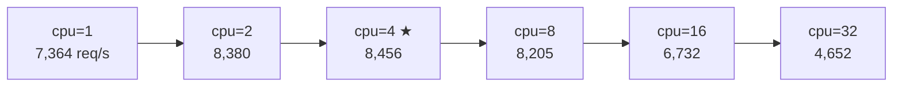

# RUBY_MAX_CPU スイープ（-c25 -m50 固定）

`RUBY_MAX_CPU`（M:N スケジューラの SNT 上限数）を変えながら biryani のスループットを計測。
Lima VM は 4 物理コア。

## パラメータ

- `-n10000 -c25 -m50 -t10`（最適パラメータ）
- サーバーは各 cpu 値ごとに再起動（環境変数を確実に反映するため）

## 結果

| RUBY_MAX_CPU | req/s | mean latency | sd | 対デフォルト比 |
|---|---|---|---|---|
| 1 | 7,364 | 147.7ms | 49.5ms | -10.2% |
| 2 | 8,380 | 129.0ms | 43.8ms | +2.1% |
| **4（物理コア数）** | **8,456** | **127.5ms** | **46.6ms** | **+3.1%** |
| 8（デフォルト） | 8,205 | 129.8ms | 41.4ms | 基準 |
| 16 | 6,732 | 153.3ms | 55.4ms | -18.0% |
| 32 | 4,652 | 237.3ms | 117.3ms | -43.3% |

## 観察



1. **ピークは物理コア数（4）と一致**: 8,456 req/s
2. **デフォルト（8）はピークより 3% 低い**: 4 コアマシンに 8 SNT は過多（各コアに 2 SNT が競合）
3. **16 以上は急落**: -18% / -43%。OS コンテキストスイッチ圧が支配的になる
4. **1 SNT でも 7,364 req/s**: blocking I/O スレッドは dedicated NT を別途取得するため、
   SNT 数が少なくても I/O 待ちで完全停止はしない

## 解釈

`RUBY_MAX_CPU` は「並列に実行できる非 blocking な Ractor スレッドの最大数」として機能する。
物理コア数を超えると OS スケジューラのコンテキストスイッチが増え、スループットが低下する。

**デフォルト値 8 の根拠に疑問**:
```c
// thread_pthread.c:1735
const int default_max_cpu = 8; // TODO: CPU num?
```

Ruby 開発者自身が物理 CPU 数に合わせるべきか検討していることがコメントから分かる。
4 コアマシンでは `RUBY_MAX_CPU=4` が最適。

## 関連ページ

- [[scenarios/sweep-c-parameter]]（-c25 -m50 が最適と分かったシナリオ）
- [[internals/ractor-mn-snt-lifecycle]]（SNT 補充ロジックの詳細）
- [[contributions/default-max-cpu-cpu-count]]（この結果から生まれた PR 候補）
