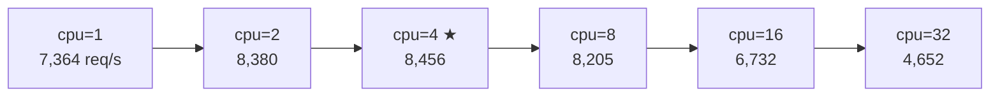

# RUBY_MAX_CPU スイープ（-c25 -m50 固定）

`RUBY_MAX_CPU`（M:N スケジューラの SNT 上限数）を変えながら biryani のスループットを計測。
Lima VM は 4 物理コア。

## パラメータ

- `-n10000 -c25 -m50 -t10`（最適パラメータ）
- サーバーは各 cpu 値ごとに再起動（環境変数を確実に反映するため）

## 結果

### 第 1 回（2026-05-17）

| RUBY_MAX_CPU | req/s | mean latency | sd | 対デフォルト比 |
|---|---|---|---|---|
| 1 | 7,364 | 147.7ms | 49.5ms | -10.2% |
| 2 | 8,380 | 129.0ms | 43.8ms | +2.1% |
| **4（物理コア数）** | **8,456** | **127.5ms** | **46.6ms** | **+3.1%** |
| 8（デフォルト） | 8,205 | 129.8ms | 41.4ms | 基準 |
| 16 | 6,732 | 153.3ms | 55.4ms | -18.0% |
| 32 | 4,652 | 237.3ms | 117.3ms | -43.3% |

### 第 2 回（2026-05-23）— 未設定ケース追加

| RUBY_MAX_CPU | req/s | mean latency | sd |
|---|---|---|---|
| **(unset)** | **7,155** | **151.2ms** | **61.1ms** |
| 1 | 8,421 | 128.5ms | 43.8ms |
| 2 | 8,560 | 127.6ms | 50.2ms |
| 4 | 8,115 | 131.1ms | 44.7ms |
| 8 | 7,479 | 142.1ms | 50.1ms |
| 16 | 6,302 | 171.8ms | 68.7ms |
| 32 | 4,437 | 247.7ms | 116.5ms |

## 観察



1. **ピークは物理コア数（4）付近**: 第1回 cpu=4（8,456）、第2回 cpu=2（8,560）。測定分散が大きく単回では確定できないが、1〜4 の範囲にピークがある傾向は再現性あり
2. **デフォルト（8）はピークより低い**: 第1回 -3%、第2回 -13%（分散あり）
3. **16 以上は急落**: 両回とも一貫。OS コンテキストスイッチ圧が支配的
4. **1 SNT でも高スループット**: blocking I/O スレッドは dedicated NT を別途取得するため、SNT 数が少なくても完全停止しない
5. **未設定（7,155）と =8（7,479）の差は 4%**: run-to-run ノイズ（第1回→第2回で =8 が 9% 変動）の範囲内

## 解釈

`RUBY_MAX_CPU` は「並列に実行できる非 blocking な Ractor スレッドの最大数」として機能する。
物理コア数を超えると OS スケジューラのコンテキストスイッチが増え、スループットが低下する。

**RUBY_MAX_CPU 未設定と =8 は同じコードパス**（`default_max_cpu = 8`）を通り、`vm->ractor.sched.max_cpu` には同じ値 8 がセットされる。測定値の差は分散範囲内で、挙動は同等と判断できる。

```c
// thread_pthread.c:1735
const int default_max_cpu = 8; // TODO: CPU num?
int max_cpu = default_max_cpu;

if (USE_MN_THREADS && max_cpu_cstr) {  // 未設定時は max_cpu_cstr = NULL → 入らない
    ...
}
vm->ractor.sched.max_cpu = max_cpu;  // → 8
```

**デフォルト値 8 の根拠に疑問**:
Ruby 開発者自身が物理 CPU 数に合わせるべきか検討していることがコメントから分かる（ko1, 2023-04-10）。
4 コアマシンでは `RUBY_MAX_CPU=4` 付近が最適。

## 関連ページ

- [scenarios/sweep-c-parameter](sweep-c-parameter.md)（-c25 -m50 が最適と分かったシナリオ）
- [internals/ractor-mn-snt-lifecycle](../internals/ractor-mn-snt-lifecycle.md)（SNT 補充ロジックの詳細）
- [contributions/default-max-cpu-cpu-count](../contributions/default-max-cpu-cpu-count.md)（この結果から生まれた PR 候補）
