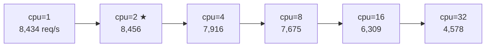

# RUBY_MAX_CPU スイープ（-c25 -m50 固定）

`RUBY_MAX_CPU`（M:N スケジューラの SNT 上限数）を変えながら biryani のスループットを計測。
Lima VM は 4 物理コア。

## パラメータ

- `-n10000 -c25 -m50 -t10`（最適パラメータ）
- サーバーは各 cpu 値ごとに再起動（環境変数を確実に反映するため）

## 結果

### 第 1 回（2026-05-17）

| RUBY_MAX_CPU | req/s | mean latency | sd | 対デフォルト比 |
|---|---|---|---|---|
| 1 | 7,364 | 147.7ms | 49.5ms | -10.2% |
| 2 | 8,380 | 129.0ms | 43.8ms | +2.1% |
| **4（物理コア数）** | **8,456** | **127.5ms** | **46.6ms** | **+3.1%** |
| 8（デフォルト） | 8,205 | 129.8ms | 41.4ms | 基準 |
| 16 | 6,732 | 153.3ms | 55.4ms | -18.0% |
| 32 | 4,652 | 237.3ms | 117.3ms | -43.3% |

### 第 2 回（2026-05-23）— 未設定ケース追加

Ruby 4.0.2（`default_max_cpu = 8` 固定）

| RUBY_MAX_CPU | req/s | mean latency | sd |
|---|---|---|---|
| **(unset)** | **7,155** | **151.2ms** | **61.1ms** |
| 1 | 8,421 | 128.5ms | 43.8ms |
| 2 | 8,560 | 127.6ms | 50.2ms |
| 4 | 8,115 | 131.1ms | 44.7ms |
| 8 | 7,479 | 142.1ms | 50.1ms |
| 16 | 6,302 | 171.8ms | 68.7ms |
| 32 | 4,437 | 247.7ms | 116.5ms |

### 第 3 回（2026-06-13）— Ruby 4.0.5（default_max_cpu = 物理 CPU 数）

Ruby 4.0.5（`default_max_cpu = sysconf(_SC_NPROCESSORS_ONLN)` = 4、[e98f95b4fd](https://github.com/ruby/ruby/blob/e98f95b4fd830c5e89941702e7b216e3212ac778/thread_pthread.c#L1802) でマージ済み）

| RUBY_MAX_CPU | req/s | mean latency | sd |
|---|---|---|---|
| **(unset)** | **7,464** | **139.7ms** | **44.6ms** |
| 1 | 8,434 | 128.7ms | 44.3ms |
| **2（ピーク）** | **8,456** | **127.5ms** | **42.5ms** |
| 4 | 7,916 | 131.8ms | 44.7ms |
| 8 | 7,675 | 138.4ms | 46.6ms |
| 16 | 6,309 | 164.6ms | 66.2ms |
| 32 | 4,578 | 239.7ms | 114.9ms |

## 観察



1. **ピークは 1〜2 の範囲**: 全3回を通じて cpu=1〜4 の範囲にピーク。4.0.5 では cpu=2 がピーク（8,456 req/s）
2. **未設定の改善（PR 効果）**: Ruby 4.0.5 で unset が 7,155 → 7,464 req/s（**+4.3%**）。`default_max_cpu` が 8 固定 → 物理 CPU 数（4）になったことで改善
3. **16 以上は急落**: 全3回で一貫。OS コンテキストスイッチ圧が支配的
4. **1 SNT でも高スループット**: blocking I/O スレッドは dedicated NT を別途取得するため、SNT 数が少なくても完全停止しない
5. **4.0.5 でピーク点が変動**: 4.0.2 では cpu=4 付近がピーク、4.0.5 では cpu=2 付近。4.0.5 でスケジューラに他の変更が入った影響と考えられる

## 解釈

`RUBY_MAX_CPU` は「並列に実行できる非 blocking な Ractor スレッドの最大数」として機能する。
物理コア数を超えると OS スケジューラのコンテキストスイッチが増え、スループットが低下する。

**Ruby 4.0.2（旧デフォルト = 8 固定）**:

```c
// thread_pthread.c:1735（Ruby 4.0.2）
const int default_max_cpu = 8; // TODO: CPU num?
```

**Ruby 4.0.5（e98f95b4fd マージ済み、物理 CPU 数）**:

```c
// thread_pthread.c:1802（Ruby 4.0.5）
const int default_max_cpu = (int)sysconf(_SC_NPROCESSORS_ONLN);
```

4 コアマシンでは unset 時の `max_cpu` が 8 → 4 に変わり、**デフォルト動作が +4.3% 改善**した。

## 関連ページ

- [scenarios/sweep-c-parameter](sweep-c-parameter.md)（-c25 -m50 が最適と分かったシナリオ）
- [internals/ractor-mn-snt-lifecycle](../internals/ractor-mn-snt-lifecycle.md)（SNT 補充ロジックの詳細）
- [contributions/default-max-cpu-cpu-count](../contributions/default-max-cpu-cpu-count.md)（この結果から生まれた PR 候補）
