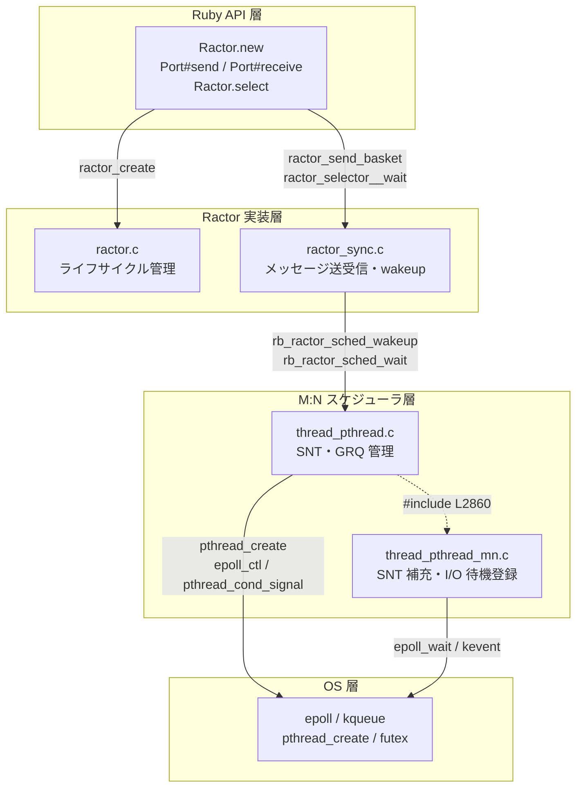
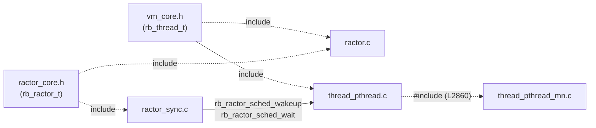

# ruby/ruby Ractor ソースコード読み方ガイド

wiki で出てきたトピックに対応させた、ソースコードの推奨読書順。
`raw/ruby-src/` は v4.0.2 のサブモジュールなので、ここに書いた行番号で直接ジャンプできる。

## 全体像

### レイヤー構成

Ruby API から OS まで 4 層に分かれる。



### ファイル依存関係

ヘッダ（点線）と関数呼び出し（実線）の 2 種類がある。
`thread_pthread_mn.c` は単独でコンパイルされず `thread_pthread.c` に verbatim include される。



---

## 読む順番

```
1. ractor_core.h          ← 構造体の地図
2. ractor.c               ← Ractor のライフサイクル
3. ractor_sync.c          ← send/recv/wakeup の実装
4. thread_pthread.c       ← M:N スケジューラ（SNT 管理・GRQ）
5. thread_pthread_mn.c    ← SNT 補充ロジック
```

---

## ステップ 1：データ構造を把握する

まず「何があるか」を頭に入れる。実行イメージより先に構造体を眺める。

**[`ractor_core.h`](https://github.com/ruby/ruby/blob/e98f95b4fd830c5e89941702e7b216e3212ac778/ractor_core.h)**

| 構造体 | 内容 | wiki |
|--------|------|------|
| `rb_ractor_t` | Ractor 本体 | [ractor-overview](internals/ractor-overview.md) |
| `rb_ractor_sync` | 同期まわり・キュー・Port | [ractor-port-implementation](internals/ractor-port-implementation.md) |
| `ractor_basket` | メッセージ 1 件 | [ractor-port-implementation](internals/ractor-port-implementation.md) |

[internals/ractor-overview](internals/ractor-overview.md) の「内部構造体」セクションが ASCII 図で整理してあるので、並べて読むと理解が速い。

---

## ステップ 2：Ractor のライフサイクルを追う

**[`ractor.c`](https://github.com/ruby/ruby/blob/e98f95b4fd830c5e89941702e7b216e3212ac778/ractor.c)**

| 読むべき関数 | 内容 | wiki |
|------------|------|------|
| [`ractor_status_set`（:164）](https://github.com/ruby/ruby/blob/e98f95b4fd830c5e89941702e7b216e3212ac778/ractor.c#L164) | `created → running → blocking → terminated` の状態遷移 | [ractor-overview](internals/ractor-overview.md) |
| `ractor_create`（近辺） | `Ractor.new` の実装、スレッド生成への入り口 | [biryani-ractor-architecture](internals/biryani-ractor-architecture.md) |

ファイルが長いので `ractor_status_set` を grep して前後を読む形で十分。

---

## ステップ 3：メッセージ送受信と wakeup

**[`ractor_sync.c`](https://github.com/ruby/ruby/blob/e98f95b4fd830c5e89941702e7b216e3212ac778/ractor_sync.c)**

| 読むべき関数 | 内容 | wiki |
|------------|------|------|
| [`ractor_send_basket`（:1185）](https://github.com/ruby/ruby/blob/e98f95b4fd830c5e89941702e7b216e3212ac778/ractor_sync.c#L1152) | `Port#send` の実装。enqueue → `ractor_wakeup_all` の流れ | [ractor-port-implementation](internals/ractor-port-implementation.md) |
| [`ractor_wakeup_all`（:972）](https://github.com/ruby/ruby/blob/e98f95b4fd830c5e89941702e7b216e3212ac778/ractor_sync.c#L944) | waiter を順に起こすループ | [ractor-sync-wakeup](internals/ractor-sync-wakeup.md) |
| `rb_ractor_sched_wakeup` | **Linux では走らない**（`#ifdef RUBY_THREAD_PTHREAD_H` の外側） | [ractor-sync-wakeup](internals/ractor-sync-wakeup.md) |
| [`ractor_selector__wait`（:1420）](https://github.com/ruby/ruby/blob/e98f95b4fd830c5e89941702e7b216e3212ac778/ractor_sync.c#L1393) | `Ractor.select` が全ポートをポーリングするループ | [ractor-select-implementation](internals/ractor-select-implementation.md) |

[internals/ractor-sync-wakeup](internals/ractor-sync-wakeup.md) の「Linux の実際のコールチェーン」を手元に置いて読むと、どの行がどのステップか追いやすい。

---

## ステップ 4：M:N スケジューラの実装（核心）

2 ファイルをセットで読む。

**[`thread_pthread.c`](https://github.com/ruby/ruby/blob/e98f95b4fd830c5e89941702e7b216e3212ac778/thread_pthread.c)**

| 読むべき箇所 | 内容 | wiki |
|------------|------|------|
| [`:1261–1267`](https://github.com/ruby/ruby/blob/e98f95b4fd830c5e89941702e7b216e3212ac778/thread_pthread.c#L1320-L1327) | `SNT_KEEP_SECONDS`・`MINIMUM_SNT` の定義 | [findings/snt-keep-seconds-disabled](findings/snt-keep-seconds-disabled.md) |
| [`:1270`（`ractor_sched_deq`）](https://github.com/ruby/ruby/blob/e98f95b4fd830c5e89941702e7b216e3212ac778/thread_pthread.c#L1332) | SNT が GRQ から Ractor を取り出すループ。`SNT_KEEP_SECONDS` のタイムアウト分岐もここ | [mn-snt-pool-growth-shrink](internals/mn-snt-pool-growth-shrink.md) |
| [`:1248`（`rb_ractor_sched_enq`）](https://github.com/ruby/ruby/blob/e98f95b4fd830c5e89941702e7b216e3212ac778/thread_pthread.c#L1290) | Ractor を GRQ に入れる | [ractor-mn-snt-lifecycle](internals/ractor-mn-snt-lifecycle.md) |
| [`:1330`（`rb_ractor_sched_wait`）](https://github.com/ruby/ruby/blob/e98f95b4fd830c5e89941702e7b216e3212ac778/thread_pthread.c#L1391) | M:N スケジューラに入って眠る | [ractor-sync-wakeup](internals/ractor-sync-wakeup.md) |
| [`:1366`（`rb_ractor_sched_wakeup`）](https://github.com/ruby/ruby/blob/e98f95b4fd830c5e89941702e7b216e3212ac778/thread_pthread.c#L1428) | pthread 版の wakeup 実装。`rb_native_cond_signal` を発行 | [ractor-sync-wakeup](internals/ractor-sync-wakeup.md) |
| [`:1802`（`ruby_mn_threads_params`）](https://github.com/ruby/ruby/blob/e98f95b4fd830c5e89941702e7b216e3212ac778/thread_pthread.c#L1802) | `default_max_cpu` の設定箇所（マージ済み、`e98f95b4fd`） | [contributions/default-max-cpu-cpu-count](contributions/default-max-cpu-cpu-count.md) |

**[`thread_pthread_mn.c`](https://github.com/ruby/ruby/blob/e98f95b4fd830c5e89941702e7b216e3212ac778/thread_pthread_mn.c)**

| 読むべき箇所 | 内容 | wiki |
|------------|------|------|
| [`:408`（`native_thread_check_and_create_shared`）](https://github.com/ruby/ruby/blob/e98f95b4fd830c5e89941702e7b216e3212ac778/thread_pthread_mn.c#L408) | SNT 補充ロジック | [ractor-mn-snt-lifecycle](internals/ractor-mn-snt-lifecycle.md) |
| [`:421`](https://github.com/ruby/ruby/blob/e98f95b4fd830c5e89941702e7b216e3212ac778/thread_pthread_mn.c#L421) | 補充条件の if 文（`snt_cnt < max_cpu`） | [mn-snt-pool-growth-shrink](internals/mn-snt-pool-growth-shrink.md) |
| [`:695`（`timer_thread_register_waiting`）](https://github.com/ruby/ruby/blob/e98f95b4fd830c5e89941702e7b216e3212ac778/thread_pthread_mn.c#L702) | I/O / タイムアウト待機の登録。タイムアウトなし → O(1)、あり → O(n) ソート挿入 | [timer-waiting-list-sort](internals/timer-waiting-list-sort.md) |
| [`:833`](https://github.com/ruby/ruby/blob/e98f95b4fd830c5e89941702e7b216e3212ac778/thread_pthread_mn.c#L840) | O(n) 挿入の TODO 箇所。biryani の IO#read はここを通らない（タイムアウトなし） | [timer-waiting-list-sort](internals/timer-waiting-list-sort.md) |

---

## 実用的なコツ

- **grep を起点にする**: 関数名（`ractor_wakeup_all`, `native_thread_dedicated_inc` 等）で grep して前後 30 行を読む方が全体を読むより速い
- **wiki の行番号**: `internals/` 各ページに書いてある `:行番号` は v4.0.2 のもの。`raw/ruby-src/` は同じバージョンのサブモジュールなので直接ジャンプできる
- **`#ifdef RUBY_THREAD_PTHREAD_H`**: このガードが出てきたら「Linux 用」のパス。`#else` ブロックは Win32 なので読み飛ばして OK

---

## 用語集

ソースを読む際に頻出する略語・概念の一覧。

| 用語 | 正式名称 / 説明 |
|------|----------------|
| **SNT** | Shared Native Thread。M:N スケジューラが複数の Ruby スレッドで共有する OS スレッド。`vm->ractor.sched.snt_cnt` で管理。 |
| **DNT** | Dedicated Native Thread。ブロッキング I/O（`IO#read` 等）中に 1 Ruby スレッドが専有する OS スレッド。`vm->ractor.sched.dnt_cnt` で管理。 |
| **GRQ** | Global Ractor Queue。実行可能な Ractor を溜めるキュー。SNT が `ractor_sched_deq` でここから Ractor を取り出す。 |
| **M:N スケジューラ** | M 個の Ruby スレッドを N 個の OS スレッド（SNT）で処理する Ruby 3.3+ の実行モデル。非 main Ractor に適用。 |
| **`dedicated_inc` / `dedicated_dec`** | `native_thread_dedicated_inc` / `native_thread_dedicated_dec`。IO ブロック開始/終了時に SNT を dedicated に移行・解除し `snt_cnt` を増減させる。 |
| **`max_cpu`** | `vm->ractor.sched.max_cpu`。SNT プールの上限。`RUBY_MAX_CPU` 環境変数または `default_max_cpu` で設定。`e98f95b4fd` で物理 CPU 数に変更済み。 |
| **`SNT_KEEP_SECONDS`** | アイドル SNT のタイムアウト秒数。`0`（デフォルト）で無効 → プールが縮小しない。`> 0` でアイドル SNT が N 秒後に自動終了。 |
| **`MINIMUM_SNT`** | SNT プールの最低維持数。現在 `0`（コメントには "for debug"）。補充条件の第一節を実質無効化。 |
| **`timer_th.waiting`** | タイムアウト付き待機エントリのソート済みリスト。`rel != NULL` のとき O(n) 挿入、`rel == NULL`（biryani の I/O は全て）のとき O(1)。 |
| **`wakeup_cond`** | `rb_ractor_t` の `sync.wakeup_cond`。recv 待機用の条件変数（Win32 のみ使用。Linux は M:N スケジューラ経由）。 |
| **`cond.readyq`** | per-SNT の条件変数（`th->nt->cond.readyq`）。Linux の `rb_ractor_sched_wakeup` がここに `signal` を発行。 |

---

## 関連ページ

- [internals/ractor-overview](internals/ractor-overview.md) — Ractor 全体像・構造体の解説
- [internals/biryani-ractor-architecture](internals/biryani-ractor-architecture.md) — biryani の Ractor 設計（Connection / recv_loop / Stream）
- [internals/ractor-port-implementation](internals/ractor-port-implementation.md) — `Ractor::Port` の C 実装・recv_queue 二段キュー
- [internals/ractor-sync-wakeup](internals/ractor-sync-wakeup.md) — wakeup メカニズム（Linux vs Win32）
- [internals/ractor-select-implementation](internals/ractor-select-implementation.md) — `Ractor.select` の C 実装
- [internals/ractor-mn-snt-lifecycle](internals/ractor-mn-snt-lifecycle.md) — SNT ライフサイクルと補充ロジック
- [internals/mn-snt-pool-growth-shrink](internals/mn-snt-pool-growth-shrink.md) — `max_cpu` と `SNT_KEEP_SECONDS` の役割
- [internals/ractor-local-gc-status](internals/ractor-local-gc-status.md) — Ractor-local GC の現状（Ruby 4.0.2）
- [internals/timer-waiting-list-sort](internals/timer-waiting-list-sort.md) — `timer_th.waiting` の O(n) ソート挿入 TODO
